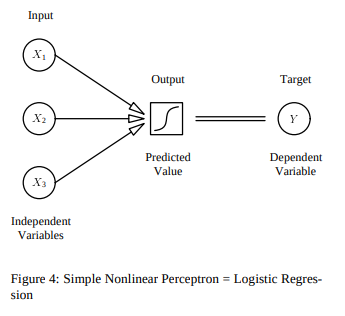

# What is Neural Network ?

Housing Price Prediction example 
  
  ``` mermaid
     Neural Network 
     size --->I(Round edge) --->price
  ```
  
  Rectified Linear Units - Non linear units
  
  
  Intermediate between Input and Output layer - __density__
  
  
  
    
  
